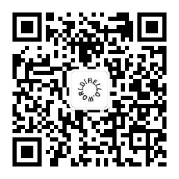

# 个人文章

## 公众号文章（时间排序）

### 2019年

#### 7月

* [东野圭吾 - 《十一字杀人》](https://mp.weixin.qq.com/s?__biz=MzI3MjMzNDUyNQ==&mid=2247483976&idx=1&sn=9900ba47fa456a90b5a6a5e26e69ef77&chksm=eb35699adc42e08c44023fb3135c64f2edb9e0d90e92e11d02f073e113ce70d23d00cc596873&token=1626014779&lang=zh_CN#rd)
* [LeetCode - 使括号有效的最少添加](https://mp.weixin.qq.com/s?__biz=MzI3MjMzNDUyNQ==&mid=2247483975&idx=1&sn=8eac063c5343e26faa3109ec3f870e13&chksm=eb356995dc42e0835945a2101d722a3eb9f6969556dd64d78bcba2438b05e7c0e47342260025&token=1626014779&lang=zh_CN#rd)
* [LeetCode - 合并二叉树](https://mp.weixin.qq.com/s?__biz=MzI3MjMzNDUyNQ==&mid=2247483974&idx=1&sn=d2781571968c84fa4711ec5b63dd731e&chksm=eb356994dc42e082a556c9a31ae3757042d0143272ffcdd5ba8693de69497ca9cbabf2928ae9&token=1626014779&lang=zh_CN#rd)
* [LeetCode - 自除数](https://mp.weixin.qq.com/s?__biz=MzI3MjMzNDUyNQ==&mid=2247483973&idx=1&sn=ab5e1986a61077a6b50e5ebf9ea8a919&chksm=eb356997dc42e081ed6d947541c939df46b4d9ca70f6166291ebce06313b4eacdad9bba4c55a&token=1626014779&lang=zh_CN#rd)
* [LeetCode - 山脉数组的封顶索引](https://mp.weixin.qq.com/s/7ss-QZ5XIhlAPiiiB-p3Ig)
* [LeetCode - 删列造序](https://mp.weixin.qq.com/s/vFHev7QpnE9velFYIVmM5g)
* [LeetCode - 最近的请求次数](https://mp.weixin.qq.com/s?__biz=MzI3MjMzNDUyNQ==&mid=2247483958&idx=1&sn=b1a1d811a5725e799aea7aeb2495140e&chksm=eb3569e4dc42e0f2f363ce0466f90c13ad346ffd4fd7d528f08bcc6de1c7d1d0530cb312d8d9&token=682540082&lang=zh_CN#rd)
* [LeetCode - 数组拆分](https://mp.weixin.qq.com/s?__biz=MzI3MjMzNDUyNQ==&mid=2247483945&idx=1&sn=4204148089605ccde6360cbe755f035d&chksm=eb3569fbdc42e0eda205b8a8fbadf56cb17e1cd674d33da7b20d78f1e02ba072a51529df0d35&token=1198394159&lang=zh_CN#rd)
* [LeetCode - N叉树的前序遍历](https://mp.weixin.qq.com/s?__biz=MzI3MjMzNDUyNQ==&mid=2247483937&idx=1&sn=9f818aa97053aaa10d3419ada50df062&chksm=eb3569f3dc42e0e5a1c612a560e868bcbf3d33adc80f9352012fa90d311eb101e6ba4d553814&token=1097053972&lang=zh_CN#rd)
* [LeetCode - 数字的补数](https://mp.weixin.qq.com/s?__biz=MzI3MjMzNDUyNQ==&mid=2247483926&idx=1&sn=d7aee8df6a3f57003ee8f30b7997219d&chksm=eb3569c4dc42e0d2ac769e32bda550f1c9a5e17d3906a0b91fe1637210f3b96054c2d0089e1e&token=575337119&lang=zh_CN#rd)
* [LeetCode - N叉树的后序遍历](https://mp.weixin.qq.com/s?__biz=MzI3MjMzNDUyNQ==&mid=2247483920&idx=1&sn=8f3259872d7815a22ff3400714f27ddd&chksm=eb3569c2dc42e0d434c21de3e489ec84e8eaf3fcfd97d8b9443c407f58839d42299fc5c80404&token=575337119&lang=zh_CN#rd)
* [2019年中社招](https://mp.weixin.qq.com/s?__biz=MzI3MjMzNDUyNQ==&mid=2247483915&idx=1&sn=7d4238b0432426e1f7db131fb08cb575&chksm=eb3569d9dc42e0cf864918190978201d606fd8644a3407c18722142a94eb5c6d5aae05444926&token=575337119&lang=zh_CN#rd)
* [LeetCode - 二叉搜索树中的搜索](https://mp.weixin.qq.com/s?__biz=MzI3MjMzNDUyNQ==&mid=2247483908&idx=1&sn=bf7404cebdbdf136973c8853dde00274&chksm=eb3569d6dc42e0c0f3d4fef64eda7c7943028dda7259a1f4371ab3fcfbb141506ddbb4825095&token=575337119&lang=zh_CN#rd)
* [LeetCode - 键盘行](https://mp.weixin.qq.com/s?__biz=MzI3MjMzNDUyNQ==&mid=2247483903&idx=1&sn=d2ebed9da445c5ee6cd09effc6cd1c37&chksm=eb356a2ddc42e33b78b3387d7aa33eeaab3ac0b298304e85e3a0fbcb63aabe860459493bffa2&token=575337119&lang=zh_CN#rd)
* [LeetCode - N叉树的最大深度](https://mp.weixin.qq.com/s?__biz=MzI3MjMzNDUyNQ==&mid=2247483898&idx=1&sn=67fd74e2044af2cea65fd26c9833e89d&chksm=eb356a28dc42e33e560a17d95a0374489c18f28af8d43beb8e44d78d9b4ad5e6fa8e7d0016e2&token=575337119&lang=zh_CN#rd)
* [LeetCode - 斐波那契数](https://mp.weixin.qq.com/s?__biz=MzI3MjMzNDUyNQ==&mid=2247483891&idx=1&sn=0689d9c2c75d646bd09a987bd633d5d6&chksm=eb356a21dc42e33739af2a07f9f26ca3f1c6e0f20a9c25ccc3bce8acd788c5fb10c6e1946e9d&token=575337119&lang=zh_CN#rd)
* [LeetCode - 单值二叉树](https://mp.weixin.qq.com/s?__biz=MzI3MjMzNDUyNQ==&mid=2247483886&idx=1&sn=c53c70ee6d0bbbc2cdef4264dbdfd47e&chksm=eb356a3cdc42e32aabac533ecfd1bad67c5580fb1d6048bb9554b4af0ffed6398602e3539849&token=575337119&lang=zh_CN#rd)

#### 6月

* [LeetCode - 反转字符串中的单词③](https://mp.weixin.qq.com/s?__biz=MzI3MjMzNDUyNQ==&mid=2247483881&idx=1&sn=bd5b9a8f5f47300ad1b10c04632b07df&chksm=eb356a3bdc42e32d3e99d70867907e585b61425d85b6619c89f7e7e42a7fabc75858319fd65d&token=575337119&lang=zh_CN#rd)
* [LeetCode - 按奇偶排序数组②](https://mp.weixin.qq.com/s?__biz=MzI3MjMzNDUyNQ==&mid=2247483880&idx=1&sn=770603e33c703baac648fa14aae57579&chksm=eb356a3adc42e32c9ba050d701d5eda3c4a5804c919d04ce7e1486576e9ff186b5088427c4d6&token=575337119&lang=zh_CN#rd)
* [LeetCode - 最小差值①](https://mp.weixin.qq.com/s?__biz=MzI3MjMzNDUyNQ==&mid=2247483871&idx=1&sn=9f68d906c8064bc15313835a3df248a6&chksm=eb356a0ddc42e31bccec66f4e98e8f43fb37902805b5ad56c618c7a73eb91437e6971920df59&token=575337119&lang=zh_CN#rd)
* [LeetCode - 最接近的三数之和](https://mp.weixin.qq.com/s?__biz=MzI3MjMzNDUyNQ==&mid=2247483870&idx=1&sn=60b3136de6849883862337040a27c075&chksm=eb356a0cdc42e31a49ae98664a1850d1bd9f06d4cde08da0d8b442b0db9257745e4e297f3d5b&token=575337119&lang=zh_CN#rd)
* [LeetCode - 电话号码的字母组合](https://mp.weixin.qq.com/s?__biz=MzI3MjMzNDUyNQ==&mid=2247483861&idx=1&sn=190d63f4cd366b3a58866ec06c700c2a&chksm=eb356a07dc42e3118410e2fb95271fc7813f97245a06fce60a5c527aa0fd9c80ce0a2a09fec6&token=575337119&lang=zh_CN#rd)
* [LeetCode - 4数之和](https://mp.weixin.qq.com/s?__biz=MzI3MjMzNDUyNQ==&mid=2247483852&idx=1&sn=7e815316ca899d41f4b537622b5b8166&chksm=eb356a1edc42e3087e92f7806843903ce3de89e4ed77fb2c8797572634cfcd2e9771f003d687&token=575337119&lang=zh_CN#rd)
* [LeetCode - 删除链表的倒数第N个节点](https://mp.weixin.qq.com/s?__biz=MzI3MjMzNDUyNQ==&mid=2247483847&idx=1&sn=ea68b62ba4a6a80bc31881197c24f3f6&chksm=eb356a15dc42e30344f89782ab832f16048675113f548b2c463811d5d22da5139654b04dbdb6&token=575337119&lang=zh_CN#rd)
* [LeetCode - 括号生成](https://mp.weixin.qq.com/s?__biz=MzI3MjMzNDUyNQ==&mid=2247483842&idx=1&sn=ae0ee5ba19a2497e9a8afb31ab9d216b&chksm=eb356a10dc42e3065664152b832aaa6ddce39f82f066d798ae9e039b031c334b53197e7cf47d&token=575337119&lang=zh_CN#rd)
* [LeetCode - 困于环中的机器人](https://mp.weixin.qq.com/s?__biz=MzI3MjMzNDUyNQ==&mid=2247483837&idx=1&sn=82972ad630d0d3944a1d3ca418a39f1d&chksm=eb356a6fdc42e379e886714c027bace8bc0da36dce2692d49ed726fee272ecf2c3f436cb4c78&token=575337119&lang=zh_CN#rd)
* [LeetCode - 不邻接植花](https://mp.weixin.qq.com/s?__biz=MzI3MjMzNDUyNQ==&mid=2247483836&idx=1&sn=f7dd218e9b2be83048dc932263509adc&chksm=eb356a6edc42e378df2d80c351ba209d22986b070a985870eefb6cb5985a17b6e4f363d69669&token=575337119&lang=zh_CN#rd)
* [LeetCode - 合并K个排序列表](https://mp.weixin.qq.com/s?__biz=MzI3MjMzNDUyNQ==&mid=2247483827&idx=1&sn=8fd90a8bc61fe8867877896e17b095ae&chksm=eb356a61dc42e3777e4d4d942972f6eaa4735dcdf599241e015c212864d9b42a19246ccd2f29&token=575337119&lang=zh_CN#rd)
* [LeetCode - 两两交换链表中的节点](https://mp.weixin.qq.com/s?__biz=MzI3MjMzNDUyNQ==&mid=2247483826&idx=1&sn=a881a626e2b281f218cccad268ff1894&chksm=eb356a60dc42e376cfb1f238382c4671e86ec68796f0bc14606daa017ccfcdf03d78d175d9af&token=575337119&lang=zh_CN#rd)
* [LeetCode - K个一组翻转链表](https://mp.weixin.qq.com/s?__biz=MzI3MjMzNDUyNQ==&mid=2247483817&idx=1&sn=2f3ec3ce29a7b635e64f099330acfe96&chksm=eb356a7bdc42e36d8cfdb3f74d52b8fc4433ba54724e6bc6b7f26fde9fc50a9cb76a0da617e9&token=575337119&lang=zh_CN#rd)
* [LeetCode - 最后一块石头的重量](https://mp.weixin.qq.com/s?__biz=MzI3MjMzNDUyNQ==&mid=2247483812&idx=1&sn=bacf628ffb189893f5aca27e60306711&chksm=eb356a76dc42e360b79d8c85b50d3f94d68f09467076962f9235221906c5f402b5b86084014c&token=575337119&lang=zh_CN#rd)
* [LeetCode - 删除字符串中的所有相邻重复项](https://mp.weixin.qq.com/s?__biz=MzI3MjMzNDUyNQ==&mid=2247483807&idx=1&sn=d9a4177c08b680223fe5e863f2591e08&chksm=eb356a4ddc42e35bd2169e4f74d6a3b5678cad54093e8acd7c6eeaf9eca21f19d16c8e1885dc&token=575337119&lang=zh_CN#rd)
* [LeetCode - 子集](https://mp.weixin.qq.com/s?__biz=MzI3MjMzNDUyNQ==&mid=2247483806&idx=1&sn=1806e382c5f8bb007f2711ac56c274fc&chksm=eb356a4cdc42e35a967000978ccc11d31ab4228257062cff27d3118b1206fc455e00dbe69875&token=575337119&lang=zh_CN#rd)
* [阿里云终面](https://mp.weixin.qq.com/s?__biz=MzI3MjMzNDUyNQ==&mid=2247483805&idx=1&sn=1d6d2f8cf673498b98a586bfeae8add9&chksm=eb356a4fdc42e359ad3e5455e3b1a54af1ea2ed4d85bcd63c0a0f6050745fba92946440529f6&token=575337119&lang=zh_CN#rd)
* [LeetCode-下一个排列](https://mp.weixin.qq.com/s?__biz=MzI3MjMzNDUyNQ==&mid=2247483791&idx=1&sn=3a77e3c718a88ecbf05fc936eae40523&chksm=eb356a5ddc42e34b84ae338fd3cf71264224291c722aaa379660b7eebc3eaa9b77400dd56fa4&token=575337119&lang=zh_CN#rd)
* [LeetCode - Z字形变换](https://mp.weixin.qq.com/s?__biz=MzI3MjMzNDUyNQ==&mid=2247483786&idx=1&sn=01eecc70e1e37dd1ad8df1605f595972&chksm=eb356a58dc42e34e7f0fd657a74d11dc9f025e0b89da8b0e06ee52998c127cbcf8051338e4aa&token=575337119&lang=zh_CN#rd)
* [端午](https://mp.weixin.qq.com/s?__biz=MzI3MjMzNDUyNQ==&mid=2247483785&idx=1&sn=1f762a4b442c98b7503f3b00a8bbf449&chksm=eb356a5bdc42e34dab58d107ca694b7d323f252c00dc16f3c2b6ebc868d24cf9aebb3a32bc24&token=575337119&lang=zh_CN#rd)
* [LeetCode - 最长回文子串](https://mp.weixin.qq.com/s?__biz=MzI3MjMzNDUyNQ==&mid=2247483780&idx=1&sn=73f35852f9a74fc8f34b18e8b061febe&chksm=eb356a56dc42e34082b7bfb91368c87db6e5158a70ae96ad6b144b6a9cbf12c81cefa6be688b&token=575337119&lang=zh_CN#rd)

#### 5月

* [19年5月社招面试经验（七）](https://mp.weixin.qq.com/s?__biz=MzI3MjMzNDUyNQ==&mid=2247483770&idx=1&sn=fe07114f12bcb551737ef47f87e7c476&chksm=eb356aa8dc42e3beae758b632b332f83a4a254a7d2f215ed67d471cbe3ec4c0e6a127402afe8&token=575337119&lang=zh_CN#rd)
* [LeetCode - 无重复字符的最长子串](https://mp.weixin.qq.com/s?__biz=MzI3MjMzNDUyNQ==&mid=2247483766&idx=1&sn=3636af30b887d36de5d934bfe9cd3973&chksm=eb356aa4dc42e3b2f10a2a28cd143d26e4f9b4cfb1429a325d7ce256f9704bd6148b358af3e6&token=575337119&lang=zh_CN#rd)
* [LeetCode - 两数相加](https://mp.weixin.qq.com/s?__biz=MzI3MjMzNDUyNQ==&mid=2247483757&idx=1&sn=7b1ee984112e099b4a26e85077d2fa66&chksm=eb356abfdc42e3a9a820d097d4f454ad7e91b23a7f4149ac612796c61986a8f9da9ac88ee2db&token=575337119&lang=zh_CN#rd)
* [LeetCode - 两数之和](https://mp.weixin.qq.com/s?__biz=MzI3MjMzNDUyNQ==&mid=2247483752&idx=1&sn=9338fc8ca4105dd94f060847f5a9ba01&chksm=eb356abadc42e3ac09cc979209fa5901dc93b2dac7c87b1cd854de8eca10eb6a7e7134ccd8de&token=575337119&lang=zh_CN#rd)
* [19年5月社招面试经验（六）](https://mp.weixin.qq.com/s?__biz=MzI3MjMzNDUyNQ==&mid=2247483745&idx=1&sn=1585e15b116c6dd0c8da98bd890305dc&chksm=eb356ab3dc42e3a5656080c9fb9caa11e7b295bb3556c3c21adefe2f5b76e98fd07e8293a87c&token=575337119&lang=zh_CN#rd)
* [19年5月社招面试经验（五）](https://mp.weixin.qq.com/s?__biz=MzI3MjMzNDUyNQ==&mid=2247483741&idx=1&sn=d3e06a4451d7ec2ffd2d6c3a0138f934&chksm=eb356a8fdc42e39918b2235bb2dc5d38c15d3bc6d59c64a01a50051fe9514ae40eff2e29f210&token=575337119&lang=zh_CN#rd)
* [19年5月社招面试经验（四）](https://mp.weixin.qq.com/s?__biz=MzI3MjMzNDUyNQ==&mid=2247483737&idx=1&sn=1207ea07035e539cde1d04bdb2192f07&chksm=eb356a8bdc42e39d99a8b187b5bbf58e17ca22a85a12d3e0c384f4e7b4438a340f54fe09698c&token=575337119&lang=zh_CN#rd)
* [19年5月社招面试经验（三）](https://mp.weixin.qq.com/s?__biz=MzI3MjMzNDUyNQ==&mid=2247483733&idx=1&sn=d36f7efc670c0d05b77dd2f7fa6483f4&chksm=eb356a87dc42e39162db6ee8e7a6b7263bb99bd0d5bcb7ad8029c23d2c75953d1ed7eb25d404&token=575337119&lang=zh_CN#rd)
* [19年5月社招面试经验（二）](https://mp.weixin.qq.com/s?__biz=MzI3MjMzNDUyNQ==&mid=2247483728&idx=1&sn=80c45cce7a0807e0f494e4af5566f883&chksm=eb356a82dc42e394f4d3fa1e476dae2c32cf8cb0c180071489a10c0652067f04139a34468c77&token=575337119&lang=zh_CN#rd)
* [19年5月社招面试经验（一）](https://mp.weixin.qq.com/s?__biz=MzI3MjMzNDUyNQ==&mid=2247483723&idx=1&sn=891ef8346a2223d88c184f345b8e972d&chksm=eb356a99dc42e38fabbf97fc698836b79d5148165f359136cdbd5336ecc32301d84d92eed0ae&token=575337119&lang=zh_CN#rd)

### 公众号二维码

